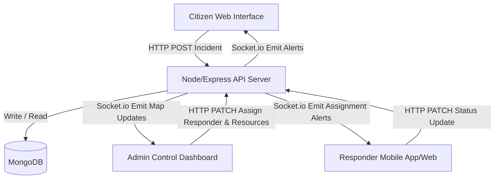

# Event Crowd Heatmap & Safety Alert System

## Powered by DisasterConnect

[](https://opensource.org/licenses/MIT)
[](https://nodejs.org/)
[](https://www.mongodb.com/)

DisasterConnect is a real-time emergency coordination platform designed to optimize safety during events and emergencies. The platform scales from localized event crowd safety monitoring to comprehensive hazard management and response operations.

---

## 📌 Problem Statement

During high-density public gatherings or emergency disasters, coordination failures cost lives. Traditional safety systems suffer from:
1. **Delayed Reporting:** Citizen reports are slow to reach responders and admin controllers.
2. **Poor Coordination:** Lack of centralized dashboards prevents rapid dispatcher deployment.
3. **Manual Resource Assignment:** Dispatching emergency personnel or supplies relies on slow, paper-based, or verbal workflows.
4. **Zero Geospatial Visibility:** Absence of a live heatmap makes finding emergency hotspots and tracking resource locations difficult.
5. **No Post-Incident Analytics:** Failure to capture response speed and dispatcher metrics leads to unoptimized workflows.

---

## 💡 Solution Overview

DisasterConnect acts as a centralized, web-based control center that bridges citizens, responders, and admins. By combining reactive geospatial reporting, Socket.io-driven real-time alert broadcasts, and automated resource workflows, DisasterConnect ensures that critical incidents are handled within minutes.

### Why This Project Matters
In critical event crowds, crowd density transitions to crowd hazard in seconds. Having a single collaborative interface allows emergency coordinators to:
- Spot incident surges before stampedes occur.
- Mobilize emergency units (first aid, food, security) dynamically.
- Automatically return resources to the inventory pool once the incident resolves.

---

## 🛠️ Core Features

- **Authentication & RBAC:** Secure session management (JWT cookies) with unique views for **Admin**, **Responder**, and **Citizen**.
- **Incident Management:** Full lifecycle logging, severity assessment (Low, Medium, High, Critical), and status updates.
- **Resource Management:** Real-time logistics tracking for food, water, medical kits, and rescue personnel.
- **Interactive Leaflet Map:** Dynamic geospatial visualization utilizing OpenStreetMap with a privacy-safe Crowd Risk Density Layer (Markers, Density, and Hybrid toggles) that aggregates coordinates into neighborhood risk zones.
- **Real-Time WebSockets:** Instantly stream safety alerts and incident status updates using Socket.io.
- **Analytics Dashboard:** Chart responder efficiency, incident severity trends, and resource dispatch percentages.
- **Resource Assignment Workflow:** Bind supplies directly to incidents, with auto-release triggers on resolution.
- **Gemini AI Triage Assistant:** Advisory decision-support parsing incident context to generate risk scores, priority recommendations, and safety checklists.
- **AI Report Assistant:** Pre-submit natural language incident draft helper classifying incident type/severity and suggesting safety tips. Built backend-only to preserve Gemini key security.
- **Incident Geolocation Lock:** Citizen incident reports enforce device GPS/browser geolocation with manual coordinates inputs disabled to prevent spoofing. Human-readable context is collected via landmark inputs.

---

## 👥 User Roles

| Role | Permissions / Responsibilities |
| :--- | :--- |
| **Admin** | Full system read/write. Verifies citizen reports, assigns responders, coordinates resource dispatch, and analyzes dashboard metrics. |
| **Responder** | Receives assigned incidents, updates response statuses in real-time, views leaflet map, and checks system alert feeds. |
| **Citizen** | Registers publicly. Submits new incident reports, tracks personal incident status history, and receives global safety alert broadcasts. |

---

## 💻 Tech Stack

- **Frontend:** React, Vite, Tailwind CSS, Leaflet Maps, Recharts, Lucide React icons, Axios
- **Backend:** Node.js, Express, MongoDB (Mongoose), Socket.io, Morgan logger, Cookie Parser
- **Authentication:** JSON Web Tokens (JWT) signed with HS256, stored in HTTP-only cookies

---

## 🏛️ Architecture Overview

DisasterConnect utilizes a client-server architecture with stateful websocket connectivity for two-way notifications:



---

## 📂 Folder Structure

```
DisasterConnect/
├── mobile/                # Expo React Native mobile application
├── backend/               # Express backend application
│   ├── src/
│   │   ├── config/        # Environment configurations & DB connections
│   │   ├── controllers/   # Route handler controllers (Auth, Incidents, Resources, Alerts, Analytics)
│   │   ├── middleware/    # Auth verification & Role validation
│   │   ├── models/        # MongoDB schemas (User, Incident, Resource, Alert)
│   │   ├── routes/        # Router mounts for all API endpoints
│   │   ├── scripts/       # Seeding scripts for quick demo setup
│   │   ├── sockets/       # Socket.io configuration and event triggers
│   │   └── app.js         # App entry and middleware configuration
│   ├── package.json
│   └── server.js          # HTTP server starter file
│
├── frontend/              # React frontend application
│   ├── src/
│   │   ├── components/    # Reusable components (layout, map, alerts)
│   │   ├── context/       # Auth context and Socket.io context
│   │   ├── pages/         # Page modules (public, auth, dashboard modules)
│   │   └── App.jsx        # Routing configuration
│   ├── package.json
│   └── tailwind.config.js
│
└── docs/                  # Project documentation folder
    ├── API_OVERVIEW.md    # Detailed API endpoint reference
    ├── DEMO_ACCOUNTS.md   # Seeded credentials mapping for evaluation
    ├── DEMO_FLOW.md       # Interactive demo script instructions
    ├── DEPLOYMENT_GUIDE.md # Production deployment configuration
    └── MIGRATION_PLAN.md  # MERN migration progress log
```

---

## ⚙️ Environment Variables

Copy the example variables into local `.env` files in both directories:

### Backend Configuration (`backend/.env`)
```env
PORT=5000
NODE_ENV=development
MONGODB_URI=mongodb://localhost:27017/disasterconnect
JWT_SECRET=your_jwt_secret_key_here
CLIENT_URL=http://localhost:5173
GEMINI_API_KEY=your_gemini_api_key
AI_TRIAGE_ENABLED=true
```

### Frontend Configuration (`frontend/.env`)
```env
VITE_API_URL=http://localhost:5000/api
```

---

## 🚀 Local Setup Instructions

### Prerequisites
- Install **Node.js** (v18.0.0 or higher)
- Ensure **MongoDB** is running locally (`mongodb://localhost:27017`)

### Step-by-Step Installation

1. **Clone the Repository:**
   ```bash
   git clone https://github.com/Shaurya-agrawal782/lnct-hack.git
   cd lnct-hack
   ```

2. **Backend Setup:**
   ```bash
   cd backend
   npm install
   cp .env.example .env
   # Ensure MONGODB_URI is set correctly in .env
   ```

3. **Seed the Database (Mandatory for Demo):**
   ```bash
   npm run seed:users       # Creates demo Admin, Responder, and Citizen accounts
   npm run seed:resources   # Provisions default logistical supply units
   npm run seed:demo        # Seeds realistic clustered demo incidents, alerts, and assignments
   ```

4. **Frontend Setup:**
   ```bash
   cd ../frontend
   npm install
   cp .env.example .env
   ```

5. **Run the Application Locally:**
   - **Start Backend Server (Port 5000):**
     ```bash
     cd ../backend
     npm run dev
     ```
   - **Start Frontend App (Port 5173):**
     ```bash
     cd ../frontend
     npm run dev
     ```
   - **Local Ports:**
     - Backend API: `http://localhost:5000` (Health Check: `http://localhost:5000/api/health`)
     - Frontend Dev Server: `http://localhost:5173`

---

## 📱 Mobile App (Expo React Native)

A separate Expo React Native mobile client is located under the `mobile/` directory, optimized for Citizen and Responder workflows.

- **Setup & Execution:**
  ```bash
  cd mobile
  npm install
  npx expo start
  ```
- **Backend Sync:** Interfaces directly with the deployed API (`https://disasterconnect-87so.onrender.com/api`).
- **Features:** Secure JWT Bearer token authorization persistence, role-based screen routing, GPS-enabled emergency incident reporting, real-time citizen incident tracking, field responder update workflows (eligible status transitions and in-field log notes), and role-aware safety alerts feeds with unread count badge indicators.

---

## 📜 Available Scripts

### In `/backend`:
- `npm start` - Run server in production.
- `npm run dev` - Run server in development mode using Nodemon.
- `npm run seed:users` - Populate test accounts.
- `npm run seed:resources` - Populate test emergency resources.
- `npm run seed:demo` - Populate realistic demo incidents, assignments, and alerts for hackathon presentation.

### In `/frontend`:
- `npm run dev` - Start the Vite dev server (`http://localhost:5173`).
- `npm run build` - Build production bundle.
- `npm run preview` - Preview production build.

---

## 🔑 Demo Accounts Reference

To evaluate the system quickly, we provision default profiles via seed scripts. Refer to [DEMO_ACCOUNTS.md](docs/DEMO_ACCOUNTS.md) for full credential mappings.

| Role | Username / Email | Password |
| :--- | :--- | :--- |
| **Admin** | `admin@disasterconnect.dev` | `Admin@12345` |
| **Responder** | `responder@disasterconnect.dev` | `Responder@12345` |
| **Citizen** | `citizen@disasterconnect.dev` | `Citizen@12345` |

---

## 🎬 Demo Workflow & API

- **Interactive Walkthrough Guide:** Check [DEMO_FLOW.md](docs/DEMO_FLOW.md) for step-by-step reporting, assignment, real-time map syncing, and resolution tasks.
- **API Reference Guide:** Check [API_OVERVIEW.md](docs/API_OVERVIEW.md) for detailed descriptions of all Express endpoints.
- **Deployment Configuration Guide:** Check [DEPLOYMENT_GUIDE.md](docs/DEPLOYMENT_GUIDE.md) for instructions on setting up MongoDB Atlas, Render, and Vercel.


---

---

## 📈 Scalability Notes & Future Scope

DisasterConnect is designed for easy horizontal scaling:
1. **Pub/Sub Broker integration:** Swap out local Socket.io memory arrays for **Redis Adapter** to handle clustered server nodes.
2. **MongoDB Geospatial Indexing:** Uses `2dsphere` indexes on incident locations for extremely fast radius queries.
3. **Future Feature Roadmap:**
   - Automated routing algorithms for responders based on live traffic congestion.
   - SMS backup system using Twilio for low-connectivity regions.

---

## 📝 Submission Note

The final submission is the MERN web platform; the earlier Python prototype was removed to keep the repository focused.

---

## 📄 License & Team Info
- **Project Scope:** Hackathon submission for "Event Crowd Heatmap & Safety Alert System".
- **License:** Licensed under the MIT License - see the `LICENSE` file for details.
